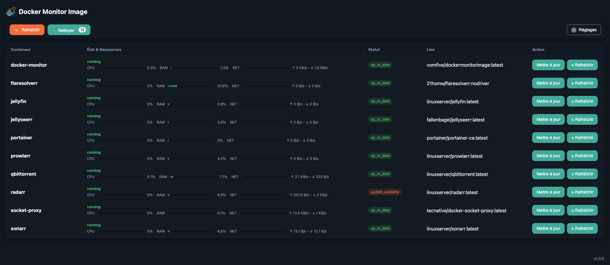
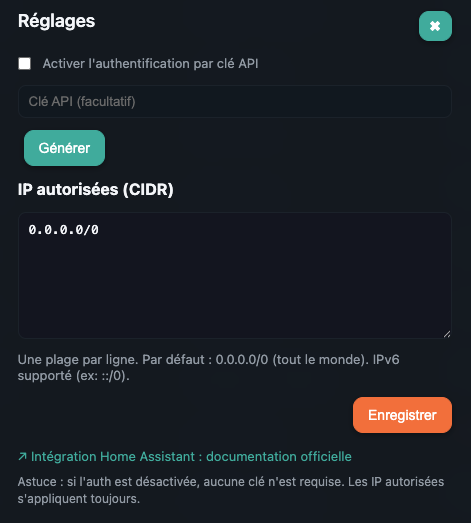

[](https://hub.docker.com/r/vomfive/dockermonitorimage)
[](https://creativecommons.org/licenses/by-nc/4.0/)

# 🐳 Docker Monitor Image

<p align="left">
  
</p>

---

# 🌍 English

This application is primarily designed to monitor and update your Docker containers from Home Assistant through the Docker Monitor Image HA integration. It exposes an API that you can use as you wish.

## ✅ Features
- 📦 Lists your Docker containers and their **available updates** (comparison by **digest** registry vs. local image);
- 📊 Displays live **metrics** (CPU, RAM, NET);
- 🔄 Allows **container updates** (pull + controlled recreation);
- 🔐 Exposes a simple **API**, with **API key** and **IP allow-list**;
- 🖥️ Provides an optional **web interface** (GUI);
- 💾 **Persists** configuration (API enabled, key, CIDR) in a file on a volume.

## ⚡ Quick Demo
- GUI: `http://<host>:5000/`
- API: `curl http://<host>:5000/diag` → `{"ok": true, "containers": [...]}`

> By default, the API is **disabled** unless activated by an environment variable or via the GUI `/settings`.  
> You can enable the API via the GUI (Settings) or through environment variables at startup.

---

## 🖼️ Screenshots
- Main View  
  

- Settings Modal  
  

---

## 🔍 How It Works
- The backend queries the **registry** (Docker Hub, GHCR, lscr.io…) via HTTP (HEAD/GET) to fetch the **image digest** (`repo:tag`).
- Compares this digest to local **RepoDigest(s)**:
  - ✅ Same digest ⇒ `up_to_date`
  - 🔔 Different digest ⇒ `update_available`
  - ⚠️ Non-comparable cases ⇒ `unknown_image`, `unknown_local_digest`, `registry_error`
- CPU/RAM/NET metrics via `docker.stats(stream=False)`.

---

## 🌐 API Endpoints
- `GET /diag` : ping Docker + list containers
- `GET /status` : status + metrics of all containers
- `GET /status/<name>` : same for a specific container
- `POST /update_container` : pull + recreate
- `GET /images/unused` / `POST /images/prune` : manage dangling images
- `GET/POST /settings` : configuration (key, allow-list, API)

> If **API_DISABLED**, all routes except `/settings` return `{"error":"api_disabled"}`.

---

## 🔒 Security
- ✅ **IP Allow-list (CIDR)**: filters access based on source IP.
- 🔑 **API Key (`?key=...`)**: required if auth is enabled.
- 📴 **API toggle**: can disable everything (except `/settings`).

Configuration via GUI or **environment variables** → persisted in `/data/settings.json`.

---

## ⚙️ Environment Variables
| Variable          | Description                          |
|-------------------|--------------------------------------|
| `GUI_ENABLED`     | `true/false` – Enable GUI            |
| `API_ENABLED`     | `true/false` – Enable API            |
| `AUTH_ENABLED`    | `true/false` – Enable auth           |
| `API_KEY`         | Initial API key                      |
| `ALLOWED_IPS`     | List of allowed CIDR IPs             |
| `SETTINGS_PATH`   | Path to persistence file             |

> After boot, `/data/settings.json` takes priority.

---

## 💾 Volume
Mount a volume at `/data` to retain `settings.json` across restarts.

---

## 🚀 Deployment
### Docker CLI
```bash
docker run -d   --name docker-monitor   -p 5000:5000   -v /var/run/docker.sock:/var/run/docker.sock   -v docker-monitor-data:/data   -e GUI_ENABLED=true   -e API_ENABLED=true   -e AUTH_ENABLED=true   -e API_KEY='change-me'   -e ALLOWED_IPS='192.168.1.0/24,127.0.0.1/32'   vomfive/dockermonitorimage:latest
```

### Docker Compose
```yaml
services:
  docker-monitor:
    image: vomfive/dockermonitorimage:latest
    container_name: docker-monitor
    ports:
      - "5000:5000"
    volumes:
      - /var/run/docker.sock:/var/run/docker.sock
      - docker-monitor-data:/data
    environment:
      GUI_ENABLED: "true"
      API_ENABLED: "true"
      AUTH_ENABLED: "true"
      API_KEY: "change-me"
      ALLOWED_IPS: "192.168.1.0/24,127.0.0.1/32"
    restart: unless-stopped

volumes:
  docker-monitor-data:
```

---

## 🧪 Example Usage
```bash
curl "http://<host>:5000/status?key=<key>"
curl -X POST "http://<host>:5000/update_container?key=<key>"   -H "Content-Type: application/json"   -d '{"name":"my_container"}'
```

---

## 📜 License
**CC BY-NC 4.0**  
This project is freely usable for **non-commercial** purposes.  
For professional or commercial use, please contact the author.  
[View full license](https://creativecommons.org/licenses/by-nc/4.0/)

---

# 🇫🇷 Français

Cette application sert principalement à monitorer et mettre à jour vos conteneurs Docker depuis Home Assistant via l'intégration Docker Monitor Image HA. Elle expose une API qui peut être exploitée comme vous le souhaitez.

## ✅ Fonctionnalités
- 📦 Liste vos conteneurs Docker et leurs **mises à jour** disponibles (comparaison par **digest** registre vs image locale) ;
- 📊 Affiche les **métriques** en direct (CPU, RAM, NET) ;
- 🔄 Permet la **mise à jour** d’un conteneur (pull + recréation contrôlée) ;
- 🔐 Expose une **API** simple, avec **clé API** et **allow-list IP** ;
- 🖥️ Propose une **interface web** optionnelle (GUI) ;
- 💾 **Persiste** la configuration (API activée, clé, CIDR) dans un fichier sur volume.

## ⚡ Démo rapide
- GUI : `http://<hôte>:5000/`
- API : `curl http://<hôte>:5000/diag` → `{"ok": true, "containers": [...]}`

> Par défaut, l’API est **désactivée** si non activée par variable d’env ou via la GUI `/settings`.  
> Vous pouvez activer l’API via la GUI (Réglages) ou par variables d’environnement au démarrage.

---

## 🖼️ Captures d’écran
- Vue principale  
  

- Modale Réglages  
  

---

## 🔍 Fonctionnement
- Le backend interroge le **registre** (Docker Hub, GHCR, lscr.io…) via HTTP (HEAD/GET) pour récupérer le **digest** de l’image (`repo:tag`).
- Compare ce digest au(x) **RepoDigest(s)** locaux :
  - ✅ **Même digest** ⇒ `up_to_date`
  - 🔔 **Digest différent** ⇒ `update_available`
  - ⚠️ Cas non comparables ⇒ `unknown_image`, `unknown_local_digest`, `registry_error`
- Métriques CPU/RAM/NET via `docker.stats(stream=False)`.

---

## 🌐 Endpoints API
- `GET /diag` : ping docker + liste des conteneurs
- `GET /status` : statut + métriques de tous les conteneurs
- `GET /status/<name>` : idem pour un conteneur
- `POST /update_container` : pull + recreate
- `GET /images/unused` / `POST /images/prune` : gestion des images dangling
- `GET/POST /settings` : configuration (clé, allow-list, API)

> Si **API_DISABLED**, toutes les routes sauf `/settings` renvoient `{"error":"api_disabled"}`.

---

## 🔒 Sécurité
- ✅ **Allow-list IP (CIDR)** : filtre l’accès selon l’IP source.
- 🔑 **Clé API (`?key=...`)** : requise si l’authentification est activée.
- 📴 **Bascule API** : permet de tout désactiver (sauf `/settings`).

Configuration via GUI ou **variables d’environnement** → persistance dans `/data/settings.json`.

---

## ⚙️ Variables d’environnement
| Variable            | Rôle                                      |
|--------------------|-------------------------------------------|
| `GUI_ENABLED`      | `true/false` – Activer la GUI             |
| `API_ENABLED`      | `true/false` – Activer l’API              |
| `AUTH_ENABLED`     | `true/false` – Activer l’authentification |
| `API_KEY`          | Clé API initiale                          |
| `ALLOWED_IPS`      | Liste d’IP CIDR autorisées                |
| `SETTINGS_PATH`    | Chemin du fichier de persistance          |

> Après le démarrage, `/data/settings.json` est prioritaire.

---

## 💾 Volume
Montez un volume `/data` pour conserver `settings.json` entre redémarrages.

---

## 🚀 Déploiement
### Docker CLI
```bash
docker run -d   --name docker-monitor   -p 5000:5000   -v /var/run/docker.sock:/var/run/docker.sock   -v docker-monitor-data:/data   -e GUI_ENABLED=true   -e API_ENABLED=true   -e AUTH_ENABLED=true   -e API_KEY='change-me'   -e ALLOWED_IPS='192.168.1.0/24,127.0.0.1/32'   vomfive/dockermonitorimage:latest
```

### Docker Compose
```yaml
services:
  docker-monitor:
    image: vomfive/dockermonitorimage:latest
    container_name: docker-monitor
    ports:
      - "5000:5000"
    volumes:
      - /var/run/docker.sock:/var/run/docker.sock
      - docker-monitor-data:/data
    environment:
      GUI_ENABLED: "true"
      API_ENABLED: "true"
      AUTH_ENABLED: "true"
      API_KEY: "change-me"
      ALLOWED_IPS: "192.168.1.0/24,127.0.0.1/32"
    restart: unless-stopped

volumes:
  docker-monitor-data:
```

---

## 🧪 Exemple
```bash
curl "http://<hôte>:5000/status?key=<clé>"
curl -X POST "http://<hôte>:5000/update_container?key=<clé>"   -H "Content-Type: application/json"   -d '{"name":"mon_conteneur"}'
```

---

## 📜 Licence
**CC BY-NC 4.0**  
Ce projet est librement utilisable à des fins **non commerciales**.  
Pour un usage professionnel ou commercial, merci de contacter l’auteur.  
[Consulter la licence complète](https://creativecommons.org/licenses/by-nc/4.0/)
